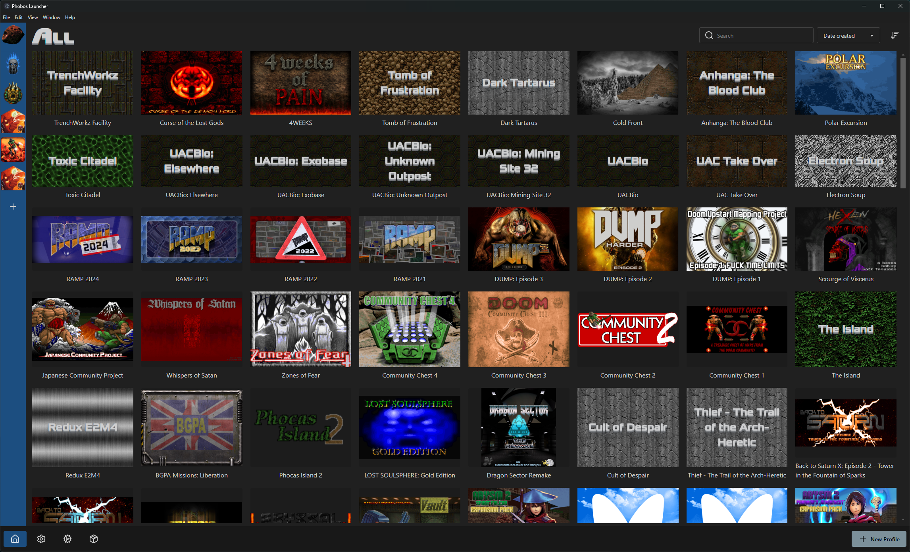

# Phobos Launcher

## A fancy, cross platform launcher for Doom and its descendants

*Heavily inspired by the [Arachnotron Doom Launcher](https://nephrite.uk/arachnotron) ❤️*

## Features

- Define multiple engines (GZdoom, Zandronum, etc.)
- Configure multiple base iwads
- Create profiles which can have any number of resource files (wads, pk3s etc)
- Profiles can inherit resources and cvars from other profiles
- Pull cover images for profiles from [SteamGridDB](https://www.steamgriddb.com/projects/grid-and-tear) within the application

## Credits

- Lycanite, author of [Arachnotron](https://nephrite.uk/arachnotron)
- European Space Agency, [hi-res photo of Phobos](https://www.esa.int/Science_Exploration/Space_Science/Mars_Express/Martian_moon_Phobos_in_detail)
- [sevmeyer](https://github.com/sevmeyer), [Oxanium and Xolonium fonts](https://sev.dev/fonts/)
- [Kenney Input Prompts](https://kenney.nl/assets/input-prompts), controller glyphs